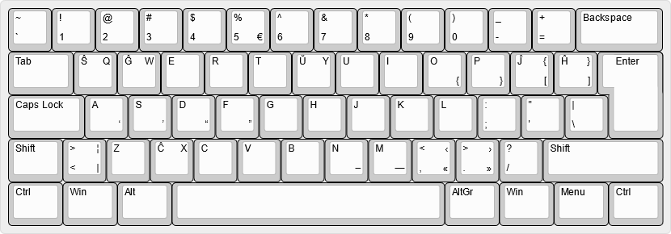

# Esperanta Klavaro | Esperanto Keyboard
 
 
Ĉi tiu estas klavarfasono por Vindozo, portida de Linukso (X11). 
Ĝi ankaŭ nomiĝas «Ekverto», aŭ ordinarlingve «ŜĜERTŬ» laŭ ĝia plej supra vico (same kiel «QWERTY» por la angla) 
 
This is a keyboard layout for Windows, ported from Linux (X11). 
It is also called "Ekverto", or colloquially "ŜĜERTŬ" after its topmost row (similarly to "QWERTY" for English) 
 
# Komputi | Compiling
Por fari, oni bezonas «msklc», kiu troviĝas [ĉi tie](https://www.microsoft.com/en-us/download/details.aspx?id=102134). 
 
To build, one needs "msklc", which can be found [here](https://www.microsoft.com/en-us/download/details.aspx?id=102134). 
 

